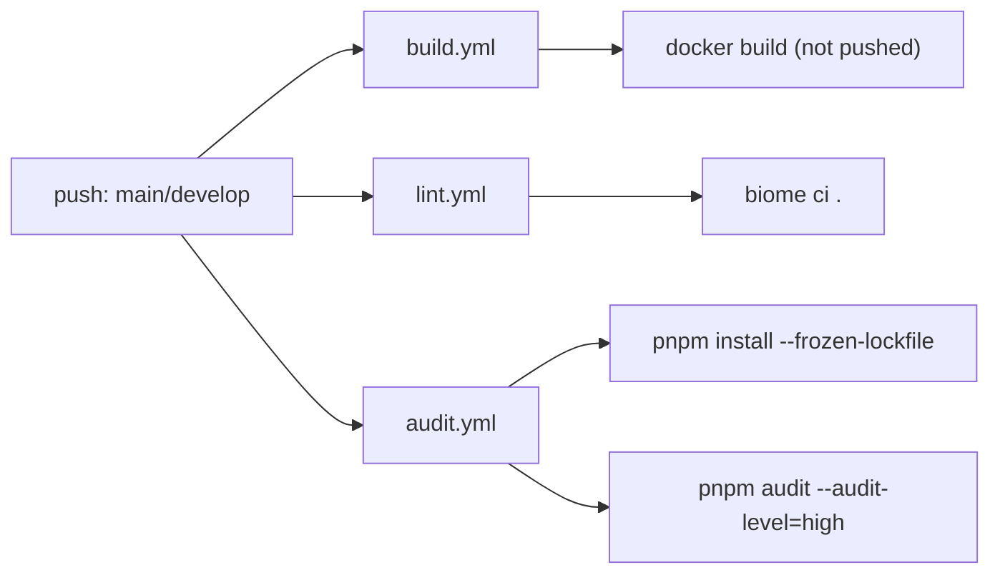
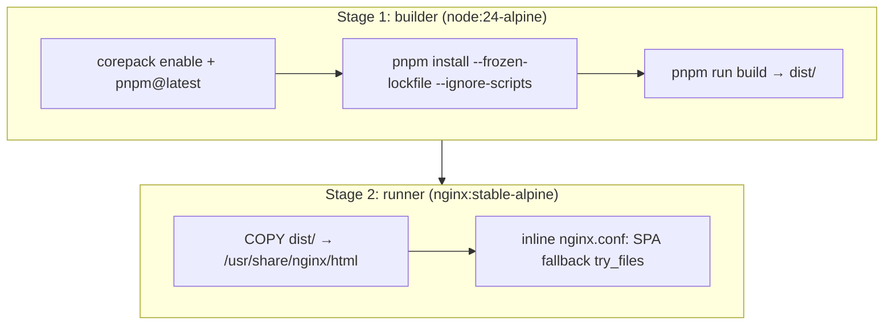

# Infrastructure

## Table of Contents

- [CI/CD Workflows](#cicd-workflows)
- [Local CI Emulation (act)](#local-ci-emulation-act)
- [Containerization](#containerization)
- [Static Deployment (.htaccess)](#static-deployment-htaccess)

---

## CI/CD Workflows

Three GitHub Actions workflows, all triggered on `push` to `main` or `develop`:



| Workflow | Runner | Steps | Notes |
|---|---|---|---|
| `build.yml` | `ubuntu-latest` | checkout → (act-only) install docker CLI → `docker build -t <repo>:<sha> .` | Image is built but **not pushed** to any registry (Factual — no `docker push` step) |
| `lint.yml` | `ubuntu-slim` | checkout → `setup-takumi-guard-npm` → `setup-biome` → `biome ci .` | Supply-chain scan runs before lint |
| `audit.yml` | `ubuntu-slim` (2 jobs) | Job 1: checkout → takumi-guard → pnpm/node setup → `pnpm install --frozen-lockfile` (install-only, no audit). Job 2 `npm-advisory-audit`: same setup → `pnpm audit --audit-level=high` | Job 1 name (`audit`) doesn't actually run an audit — **Speculative**: likely intended as a supply-chain-scan-only gate distinct from the advisory-audit job |

Actions pinned: `actions/checkout@v6`, `actions/setup-node@v7`, `pnpm/action-setup@v6`, `biomejs/setup-biome@v2`, Node `24`.

## Local CI Emulation (act)

`.actrc`:
```
--container-daemon-socket npipe:////./pipe/podman-machine-default
-P ubuntu-latest=catthehacker/ubuntu:act-24.04
-P ubuntu-slim=catthehacker/ubuntu:act-24.04
```

Runs GitHub Actions locally via [`act`](https://github.com/nektos/act), using **Podman** (not Docker) as the container daemon on Windows (`npipe` socket). `package.json` scripts: `act`, `act:audit`, `act:build`, `act:lint`.

**Factual**: `build.yml`'s "Install docker CLI (act only)" step (`if: ${{ env.ACT }}`) exists because the `act` runner image lacks a `docker` CLI needed for the `docker build` step — a workaround specific to local emulation, not real GitHub-hosted runners.

## Containerization

`Dockerfile` — multi-stage build:



- Final image serves only static `dist/` output via nginx on port 80.
- SPA routing handled by `try_files $uri $uri/ /index.html;` (client-side routing fallback, though this app has no router — defensive default).

`docker-compose.yml` — **dev only**:
```yaml
services:
  app:
    build: { context: ., target: builder }
    ports: ["5173:5173"]
    volumes: [".:/app", "/app/node_modules"]
    command: pnpm run dev -- --host 0.0.0.0
```
Targets the `builder` stage directly (skips nginx stage) and runs Vite dev server with hot-reload via bind mount.

## Static Deployment (.htaccess)

Apache rewrite rules for serving the SPA from a subpath/htdocs-style host (e.g., Laragon):

```apache
RewriteEngine On
<FilesMatch "\.(js|mjs|jsx|ts|tsx)$">
    Header set Content-Type "application/javascript"
</FilesMatch>
RewriteRule ^assets/(.*)$ dist/assets/$1 [L]
RewriteRule ^$ dist/index.html [L]
```

**Known limitation** (Factual, confirmed via user session): Apache serving `dist/` statically does **not** provide Vite's dev-only `server.proxy` rewrite (`/api/gpt4all → localhost:4891`, see [[configurations]]). Any provider routed through that proxy path (GPT4ALL) 404s under this deployment mode unless an equivalent `ProxyPass`/`ProxyPassReverse` is added to the Apache vhost. See [[known_bugs]].

<!-- commit: 1e98095b63fc3c649e8e1d7f4cd9e3fe5b911b34 -->
