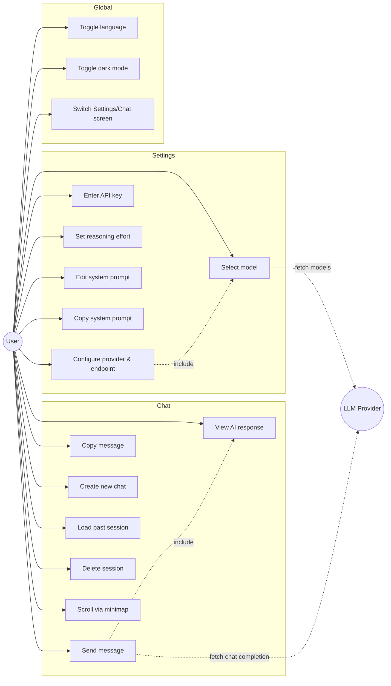

# Use Cases

## Table of Contents

- [Actors](#actors)
- [Use Case Diagram](#use-case-diagram)

---

## Actors

- **User** — the sole actor; no admin/multi-user roles exist (single-browser-profile app).
- **LLM Provider** — external system (OpenAI / LM Studio / GPT4ALL / Ollama / llama.cpp), not a human actor but modeled as a secondary actor since the app integrates with it directly.

## Use Case Diagram

See [[screens]] for the two screens these use cases map to, [[components]] for the components implementing each, and [[databases]] for what's persisted.

<!-- commit: 1e98095b63fc3c649e8e1d7f4cd9e3fe5b911b34 -->
